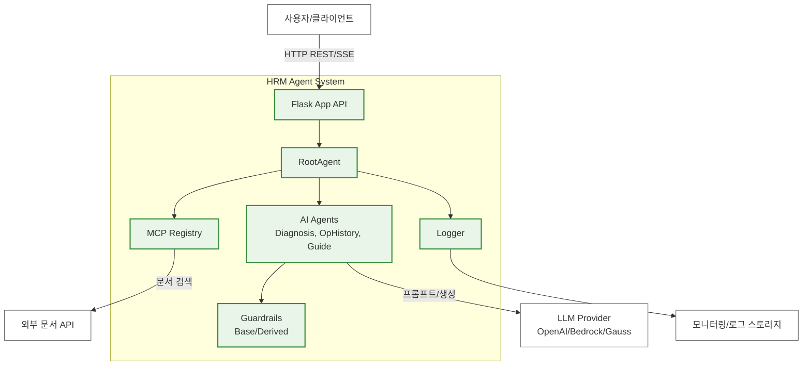
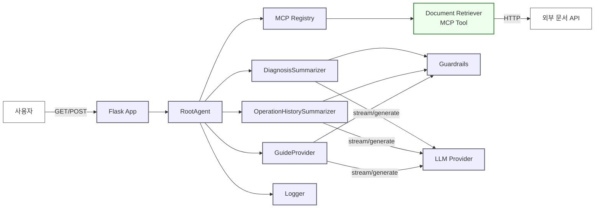
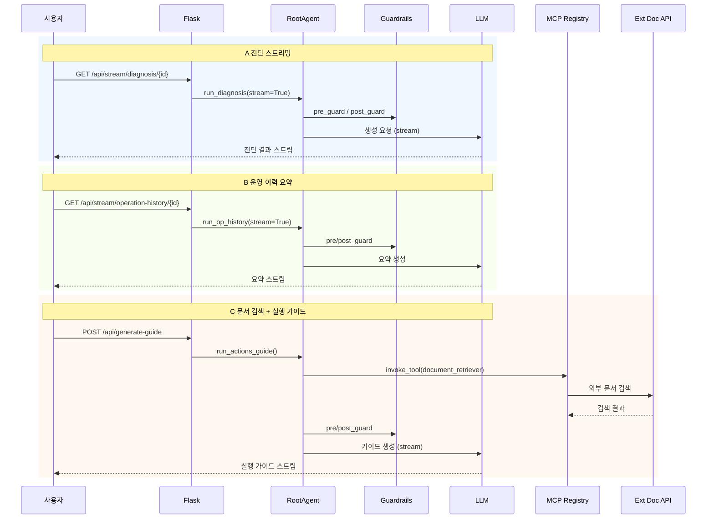
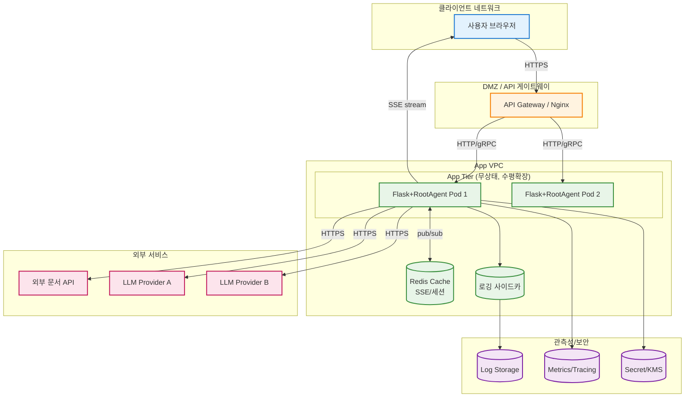
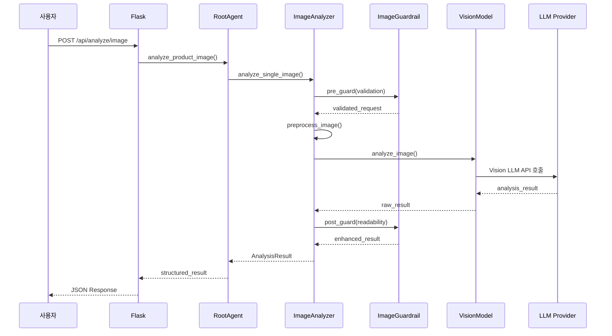

# Architecture Views

이 문서는 시스템을 설명하는 5가지 주요 아키텍처 뷰를 담고 있습니다.

---

## 1. 컨텍스트(시스템 경계) 뷰

---

## 2. C&C(컴포넌트 & 커넥터) / 런타임 뷰

---

## 3. 모듈(정적 구조) 뷰

```mermaid
flowchart TB
    subgraph app["Application Layer"]
      FlaskApp[app.py<br/>Flask Application]
      RootAgentMod[agents/root_agent.py<br/>Agent Orchestration]
      Config[configure.json<br/>Configuration]
    end

    subgraph agents["AI Agents Layer"]
      Diag[agents/diagnosis_summarizer.py<br/>Diagnosis Agent]
      OpHist[agents/op_history_summarizer.py<br/>Operation History Agent]
      GuideProv[agents/guide_provider.py<br/>Guide Provider]
      ImageAnalyzer[agents/image_analyzer.py<br/>Image Analyzer]
    end

    subgraph guardrails["Guardrails Layer"]
      BaseGR[agents/guardrails.py<br/>Base Guardrail]
      Readability[agents/readability_checker.py<br/>Readability Checker]
    end

    subgraph tools["Tools Layer"]
      MCPReg[agents/mcp.py<br/>MCP Registry]
      GuideRet[agents/retriever.py<br/>Guide Retriever]
      PromptBuilder[agents/prompt_builder.py<br/>Prompt Builder]
    end

    subgraph llm["LLM Integration Layer"]
      LLMProviders[agents/llm_providers.py<br/>LLM Provider Factory]
      OpenAIClient[agents/llm_client_openai.py<br/>OpenAI Client]
      BedrockClient[agents/llm_client_bedrock.py<br/>Bedrock Client]
      GaussClient[agents/llm_client_gauss.py<br/>Gauss Client]
    end

    FlaskApp --> RootAgentMod
    RootAgentMod --> Diag
    RootAgentMod --> OpHist
    RootAgentMod --> GuideProv
    RootAgentMod --> ImageAnalyzer
    RootAgentMod --> MCPReg
    MCPReg --> GuideRet
    Diag --> BaseGR
    OpHist --> BaseGR
    GuideProvider --> BaseGR
    ImageAnalyzer --> BaseGR
    BaseGR --> Readability
    GuideProv --> PromptBuilder
    Diag --> PromptBuilder
    OpHist --> PromptBuilder
    ImageAnalyzer --> PromptBuilder
    Diag --> LLMProviders
    OpHist --> LLMProviders
    GuideProvider --> LLMProviders
    ImageAnalyzer --> LLMProviders
    LLMProviders --> OpenAIClient
    LLMProviders --> BedrockClient
    LLMProviders --> GaussClient
    RootAgentMod --> Config

    classDef appLayer fill:#e3f2fd,stroke:#1976d2,stroke-width:2px
    classDef agentLayer fill:#f3e5f5,stroke:#7b1fa2,stroke-width:2px
    classDef guardLayer fill:#fff3e0,stroke:#f57c00,stroke-width:2px
    classDef toolLayer fill:#e8f5e8,stroke:#388e3c,stroke-width:2px
    classDef llmLayer fill:#ffebee,stroke:#d32f2f,stroke-width:2px
    
    class FlaskApp,RootAgentMod,Config appLayer
    class Diag,OpHist,GuideProv,ImageAnalyzer agentLayer
    class BaseGR,Readability guardLayer
    class MCPReg,GuideRet,PromptBuilder toolLayer
    class LLMProviders,OpenAIClient,BedrockClient,GaussClient llmLayer
```

---

## 4. 주요 시나리오(시퀀스) 뷰

---

## 5. 배포/인프라(Deployment/Allocation) 뷰

---

## 6. 이미지 분석 시나리오

---

## 다이어그램 렌더링 가이드

### Mermaid 뷰어 사용법:
1. **온라인 뷰어**: https://mermaid.live/
2. **VS Code 확장**: Mermaid Preview
3. **GitHub**: 마크다운에서 자동 렌더링

### 주요 문법 규칙:
- 노드명에 특수문자 사용 시 대괄호 `[]` 사용
- 서브그래프는 `subgraph name["표시명"]` 형식
- 화살표 라벨은 `|라벨|` 형식
- 클래스 정의는 `classDef` 사용

### 문제 해결:
- **노드명 충돌**: 고유한 이름 사용
- **특수문자**: 이스케이프 처리
- **긴 텍스트**: ` ` 사용하여 줄바꿈
- **한글**: UTF-8 인코딩 확인
