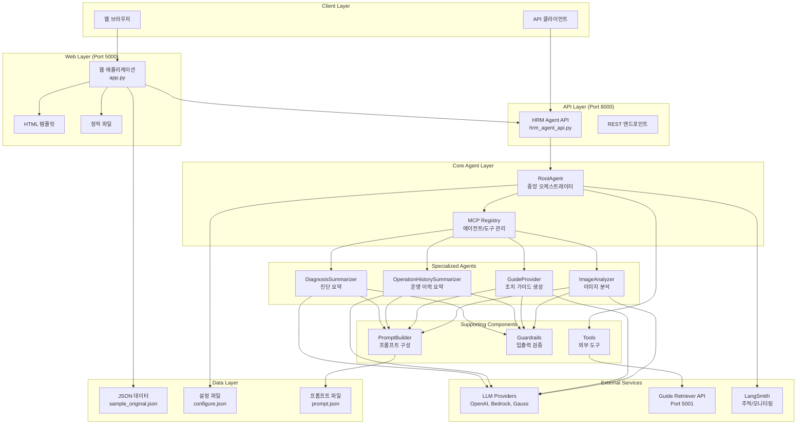

# HRM Agent 시스템 아키텍처 개요

## 시스템 구조

HRM Agent 시스템은 마이크로서비스 아키텍처를 기반으로 한 모듈형 AI 에이전트 시스템입니다.

### 전체 아키텍처



## 주요 컴포넌트

### 1. 웹 레이어 (Port 5000)
- **웹 애플리케이션 (app.py)**: 사용자 인터페이스 제공
- **템플릿**: HTML 템플릿 (index.html, data_review.html 등)
- **정적 파일**: CSS, JavaScript, 이미지 등

### 2. API 레이어 (Port 8000)
- **HRM Agent API (hrm_agent_api.py)**: RESTful API 서버
- **엔드포인트**: 진단, 운영이력, 조치가이드, 이미지분석 등

### 3. 코어 에이전트 레이어
- **RootAgent**: 중앙 오케스트레이터, 모든 에이전트와 도구를 관리
- **MCP Registry**: MCP 스타일의 에이전트/도구 레지스트리

### 4. 전문 에이전트들
- **DiagnosisSummarizer**: 가전 진단 정보 요약
- **OperationHistorySummarizer**: 제품 사용 이력 요약
- **GuideProvider**: 진단/이력 기반 조치 가이드 생성
- **ImageAnalyzer**: 이미지 분석을 통한 결함 탐지 및 증상 분석

### 5. 지원 컴포넌트
- **PromptBuilder**: LLM별, 에이전트별 프롬프트 구성
- **Guardrails**: 입력/출력 검증 및 후처리
- **Tools**: 외부 도구 및 API 연동

## 데이터 플로우

### 1. 진단 요약 플로우
```
사용자 입력 → 웹앱 → API → RootAgent → DiagnosisSummarizer → LLM → 스트리밍 응답
```

### 2. 이미지 분석 플로우
```
이미지 업로드 → 전처리 → 비전 모델 → 결함 분류 → 구조화된 결과
```

### 3. 조치 가이드 플로우
```
진단 요약 → 문서 검색 → 가이드 생성 → 가독성 분석 → 최종 가이드
```

## 설계 원칙

### 1. 모듈성 (Modularity)
- 각 에이전트는 독립적으로 동작
- 명확한 인터페이스를 통한 상호작용
- 플러그인 방식의 확장 가능

### 2. 확장성 (Scalability)
- API 서버와 웹 서버 분리
- 마이크로서비스 아키텍처 준비
- 수평적 확장 가능한 구조

### 3. 유연성 (Flexibility)
- 다양한 LLM 프로바이더 지원
- 설정 기반 동적 구성
- MCP 스타일의 동적 등록

### 4. 관찰 가능성 (Observability)
- LangSmith 통합 추적
- 구조화된 로깅
- 성능 모니터링

### 5. 안정성 (Reliability)
- Guardrail을 통한 입출력 검증
- 에러 핸들링 및 복구
- 헬스 체크 및 모니터링

## 기술 스택

### Backend
- **Python 3.9+**: 메인 개발 언어
- **Flask**: 웹 프레임워크
- **Requests**: HTTP 클라이언트
- **JSON**: 데이터 교환 형식

### AI/ML
- **OpenAI GPT**: 텍스트 생성 및 비전 분석
- **Amazon Bedrock**: 클라우드 기반 LLM
- **Gauss/GaussO**: 전용 LLM 서비스
- **LangSmith**: AI 애플리케이션 추적

### Frontend
- **HTML5/CSS3**: 웹 인터페이스
- **JavaScript**: 클라이언트 사이드 로직
- **Server-Sent Events**: 실시간 스트리밍

### Infrastructure
- **Docker**: 컨테이너화 (선택사항)
- **Git**: 버전 관리
- **JSON Config**: 설정 관리

## 보안 고려사항

### 1. API 보안
- CORS 설정을 통한 교차 출처 요청 제어
- 입력 데이터 검증 및 살균
- 에러 메시지 최소화

### 2. 데이터 보안
- 민감한 정보 환경변수 저장
- API 키 및 자격증명 보호
- 이미지 데이터 임시 저장 및 삭제

### 3. 네트워크 보안
- HTTPS 사용 권장
- 방화벽 규칙 설정
- 내부 서비스 간 통신 보호

## 성능 최적화

### 1. 스트리밍
- Server-Sent Events를 통한 실시간 응답
- 청크 단위 데이터 전송
- 사용자 경험 향상

### 2. 캐싱
- 설정 파일 캐싱
- 프롬프트 템플릿 캐싱
- LLM 응답 캐싱 (선택사항)

### 3. 비동기 처리
- 멀티스레드 지원
- 논블로킹 I/O
- 병렬 처리 최적화

## 확장 계획

### 1. 단기 계획
- 더 많은 이미지 분석 기능
- 추가 LLM 프로바이더 지원
- 성능 모니터링 강화

### 2. 중기 계획
- 데이터베이스 통합
- 사용자 인증 및 권한 관리
- API 버전 관리

### 3. 장기 계획
- 쿠버네티스 배포
- 마이크로서비스 완전 분리
- AI 모델 파인튜닝 지원
