# HRM Agent 시스템 클래스 다이어그램

```mermaid
classDiagram
    %% API Layer
    class HRMAgentAPI {
        -root_agent: RootAgent
        +health() dict
        +get_capabilities() dict
        +run_diagnosis(data: dict) dict
        +stream_diagnosis(data: dict) Response
        +run_operation_history(data: dict) dict
        +stream_operation_history(data: dict) Response
        +run_actions_guide(data: dict) dict
        +stream_actions_guide(data: dict) Response
        +call_tool(tool_name: str, data: dict) dict
        +invoke_mcp_tool(tool_name: str, data: dict) dict
        +create_error_response(message: str) tuple
        +create_success_response(data: Any) dict
    }
    
    class WebApp {
        -json_data: list
        +index() str
        +data_review() str
        +get_all_data() dict
        +get_item_data(item_id: str) dict
        +stream_diagnosis(item_id: str) Response
        +stream_operation_history(item_id: str) Response
        +stream_actions_guide(item_id: str) Response
        +check_api_server_health() bool
        +health() dict
    }
    
    %% Core Agent Layer
    class RootAgent {
        -agents: Dict[str, Any]
        -tools: Dict[str, Tool]
        -mcp: MCPRegistry
        -config: Dict[str, Any]
        -provider: str
        -provider_kwargs: Dict[str, Any]
        +register_agent(name: str, agent: Any) None
        +register_tool(name: str, tool: Tool) None
        +run_diagnosis(analytics: dict, language: str) Generator
        +run_op_history(operation_history: dict, language: str) Generator
        +run_actions_guide(diagnosis_summary: str, category: str, language: str) Generator
        +call_tool(tool_name: str, *args, **kwargs) Generator
        +list_capabilities() Dict[str, Any]
        +get_mcp_manifest() str
        +invoke_mcp_tool(name: str, *args, **kwargs) Any
        -_load_config() Dict[str, Any]
        -_configure_langsmith() None
        -_trace_ctx(name: str) Any
    }
    
    %% Agent Classes
    class DiagnosisSummarizer {
        -provider: str
        -provider_kwargs: dict
        -prompt_builder: PromptBuilder
        -guardrail: Guardrail
        +summarize(analytics: dict, language: str, stream: bool) Generator
        -_build_diagnosis_text(analytics: dict) str
    }
    
    class OperationHistorySummarizer {
        -provider: str
        -provider_kwargs: dict
        -prompt_builder: PromptBuilder
        -guardrail: Guardrail
        +summarize(operation_history: dict, language: str, stream: bool) Generator
    }
    
    class GuideProvider {
        -provider: str
        -provider_kwargs: dict
        -prompt_builder: PromptBuilder
        -guardrail: Guardrail
        +provide(diagnosis_summary: str, op_summary: str, language: str, stream: bool) Generator
        +provide_actions_guide(diagnosis_summary: str, retrieved_documents: str, language: str, stream: bool) Generator
    }
    
    class ImageAnalyzer {
        -provider: str
        -provider_kwargs: dict
        -prompt_builder: PromptBuilder
        -guardrail: ImageAnalysisGuardrail
        -preprocessor: ImagePreprocessor
        -vision_model: VisionModelInterface
        -defect_classifier: DefectClassifier
        -analysis_history: List[AnalysisResult]
        +analyze_single_image(image_data: bytes, filename: str, analysis_type: AnalysisType, language: str) AnalysisResult
        +analyze_multiple_images(images: List, analysis_type: AnalysisType, language: str) List[AnalysisResult]
        +stream_analysis(image_data: bytes, filename: str, analysis_type: AnalysisType, language: str) Generator
        +detect_defects(image_data: bytes, filename: str, confidence_threshold: float) List[DefectLocation]
        +generate_maintenance_report(analysis_result: AnalysisResult, include_images: bool) Dict
        +compare_with_reference(current_image: bytes, reference_image: bytes, current_filename: str, reference_filename: str) AnalysisResult
        +get_analysis_history(limit: int, analysis_type: AnalysisType) List[AnalysisResult]
        +export_results(analysis_results: List, format: str, include_images: bool) Union[str, bytes]
        -_preprocess_image(image_data: bytes, filename: str) tuple
        -_build_analysis_prompt(analysis_type: AnalysisType, language: str, additional_context: str) str
        -_post_process_result(raw_result: str, image_metadata: ImageMetadata, analysis_type: AnalysisType) AnalysisResult
    }
    
    %% Image Analysis Supporting Classes
    class ImagePreprocessor {
        +validate_image(image_data: bytes, filename: str) bool
        +extract_metadata(image_data: bytes, filename: str) ImageMetadata
        +resize_image(image_data: bytes, max_size: tuple) bytes
        +convert_to_base64(image_data: bytes, format: ImageFormat) str
        +enhance_image_quality(image_data: bytes) bytes
    }
    
    class VisionModelInterface {
        -provider: str
        -provider_kwargs: dict
        -llm_client: Any
        +initialize_model() None
        +analyze_image(image_base64: str, prompt: str) str
        +batch_analyze_images(images: List[str], prompts: List[str]) List[str]
        +stream_analysis(image_base64: str, prompt: str) Generator
    }
    
    class DefectClassifier {
        -defect_categories: dict
        -severity_rules: dict
        +load_defect_categories(categories_config: dict) None
        +classify_defect(defect_description: str) tuple[str, Severity]
        +calculate_severity(defect_features: dict) Severity
        +get_recommendations(defect_category: str, severity: Severity) List[str]
    }
    
    %% MCP Registry
    class MCPRegistry {
        -agents: Dict[str, Any]
        -tools: Dict[str, MCPTool]
        -tool_metadata: Dict[str, ToolMetadata]
        -agent_metadata: Dict[str, AgentMetadata]
        +register_agent(name: str, agent: Any, metadata: AgentMetadata) None
        +register_tool(name: str, tool: MCPTool, metadata: ToolMetadata) None
        +get_tool(name: str) MCPTool
        +get_agent(name: str) Any
        +list_tools() Dict[str, Dict[str, Any]]
        +list_agents() Dict[str, Dict[str, Any]]
        +list() Dict[str, Any]
        +invoke_tool(name: str, *args, **kwargs) Any
        +to_mcp_manifest() str
    }
    
    %% Supporting Classes
    class PromptBuilder {
        -default_language: str
        +build_diagnosis_prompt(device_type: str, diagnosis_text: str, provider: str, language: str) str
        +build_operation_history_prompt(operation_history: dict, provider: str, language: str) str
        +build_guide_prompt(diagnosis_summary: str, op_summary: str, provider: str, language: str) str
        +build_actions_guide_prompt(diagnosis_summary: str, retrieved_documents: str, language: str) str
        +build_image_analysis_prompt(analysis_type: AnalysisType, language: str) str
    }
    
    class Guardrail {
        +pre_guard(payload: dict) dict
        +post_guard(output: str) str
    }
    
    class ImageAnalysisGuardrail {
        -include_readability_report: bool
        +pre_guard(payload: dict) dict
        +post_guard(output: str) str
        +validate_image_analysis_input(payload: dict) dict
        +sanitize_analysis_output(output: str) str
    }
    
    class GuideRetriever {
        -api_base_url: str
        +stream(query: str, category_filter: str) Generator
        +as_mcp_tool() Callable
        +get_mcp_metadata() ToolMetadata
    }
    
    %% Data Classes and Enums
    class ImageFormat {
        <<enumeration>>
        JPEG
        PNG
        WEBP
        GIF
        BMP
    }
    
    class AnalysisType {
        <<enumeration>>
        DEFECT_DETECTION
        SYMPTOM_DESCRIPTION
        QUALITY_ASSESSMENT
        COMPARATIVE_ANALYSIS
        MAINTENANCE_RECOMMENDATION
    }
    
    class Severity {
        <<enumeration>>
        CRITICAL
        HIGH
        MEDIUM
        LOW
        NORMAL
    }
    
    class ImageMetadata {
        +filename: str
        +file_size: int
        +format: ImageFormat
        +dimensions: tuple[int, int]
        +upload_timestamp: str
        +checksum: str
    }
    
    class DefectLocation {
        +x: int
        +y: int
        +width: int
        +height: int
        +confidence: float
        +description: str
    }
    
    class AnalysisResult {
        +analysis_id: str
        +image_metadata: ImageMetadata
        +analysis_type: AnalysisType
        +severity: Severity
        +confidence_score: float
        +primary_symptoms: List[str]
        +detailed_description: str
        +defect_locations: List[DefectLocation]
        +recommendations: List[str]
        +technical_details: Dict[str, Any]
        +processing_time: float
        +model_version: str
    }
    
    class ToolMetadata {
        +name: str
        +description: str
        +input_schema: Dict[str, Any]
        +output_schema: Dict[str, Any]
    }
    
    class AgentMetadata {
        +name: str
        +description: str
        +capabilities: List[str]
    }
    
    %% LLM Providers
    class LLMProvider {
        <<interface>>
        +generate(prompt: str, stream: bool) Any
    }
    
    %% Relationships
    HRMAgentAPI --> RootAgent : uses
    WebApp --> HRMAgentAPI : calls via HTTP
    
    RootAgent --> MCPRegistry : manages
    RootAgent --> DiagnosisSummarizer : orchestrates
    RootAgent --> OperationHistorySummarizer : orchestrates  
    RootAgent --> GuideProvider : orchestrates
    RootAgent --> ImageAnalyzer : orchestrates
    RootAgent --> GuideRetriever : uses as tool
    
    MCPRegistry --> ToolMetadata : stores
    MCPRegistry --> AgentMetadata : stores
    
    DiagnosisSummarizer --> PromptBuilder : uses
    DiagnosisSummarizer --> Guardrail : uses
    DiagnosisSummarizer --> LLMProvider : uses
    
    OperationHistorySummarizer --> PromptBuilder : uses
    OperationHistorySummarizer --> Guardrail : uses
    OperationHistorySummarizer --> LLMProvider : uses
    
    GuideProvider --> PromptBuilder : uses
    GuideProvider --> Guardrail : uses
    GuideProvider --> LLMProvider : uses
    
    ImageAnalyzer --> PromptBuilder : uses
    ImageAnalyzer --> ImageAnalysisGuardrail : uses
    ImageAnalyzer --> ImagePreprocessor : uses
    ImageAnalyzer --> VisionModelInterface : uses
    ImageAnalyzer --> DefectClassifier : uses
    ImageAnalyzer --> AnalysisResult : creates
    
    ImagePreprocessor --> ImageMetadata : creates
    ImagePreprocessor --> ImageFormat : uses
    
    VisionModelInterface --> LLMProvider : uses
    
    DefectClassifier --> Severity : uses
    DefectClassifier --> DefectLocation : creates
    
    ImageAnalysisGuardrail --|> Guardrail : inherits
    
    AnalysisResult --> ImageMetadata : contains
    AnalysisResult --> AnalysisType : uses
    AnalysisResult --> Severity : uses
    AnalysisResult --> DefectLocation : contains
    
    GuideRetriever --> ToolMetadata : provides
```

## 클래스 설명

### API Layer
- **HRMAgentAPI**: RootAgent의 기능을 RESTful API로 제공하는 Flask 기반 서버
- **WebApp**: 웹 UI를 제공하고 HRM Agent API를 호출하는 웹 서버

### Core Agent Layer
- **RootAgent**: 모든 에이전트와 도구를 오케스트레이션하는 중앙 관리자
- **DiagnosisSummarizer**: 가전 진단 정보를 요약하는 에이전트
- **OperationHistorySummarizer**: 제품 사용 이력을 요약하는 에이전트
- **GuideProvider**: 진단/이력 기반 조치 가이드를 생성하는 에이전트
- **ImageAnalyzer**: 이미지 분석을 통한 결함 탐지 및 증상 분석을 수행하는 에이전트

### Image Analysis Components
- **ImagePreprocessor**: 이미지 전처리 및 형식 변환 담당
- **VisionModelInterface**: 다양한 비전 모델(GPT-4V, Claude Vision 등)과의 인터페이스
- **DefectClassifier**: 탐지된 결함을 분류하고 심각도를 평가

### Supporting Classes
- **MCPRegistry**: MCP 스타일의 에이전트/도구 레지스트리
- **PromptBuilder**: LLM 및 에이전트별 프롬프트 구성
- **Guardrail**: 입력/출력 검증 및 가드레일
- **GuideRetriever**: 키워드 기반 가이드 검색 도구
