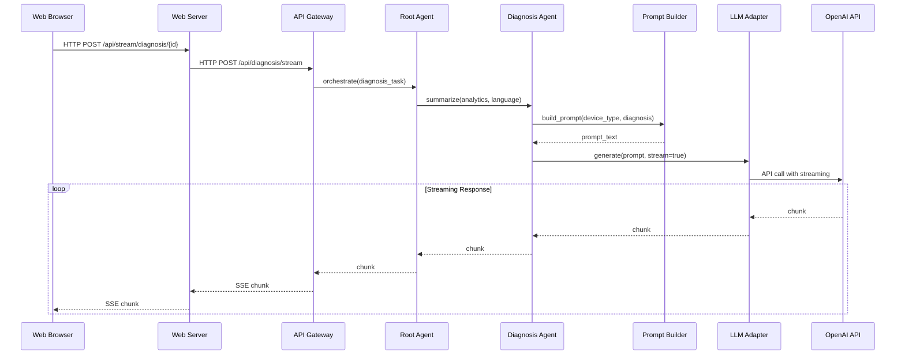
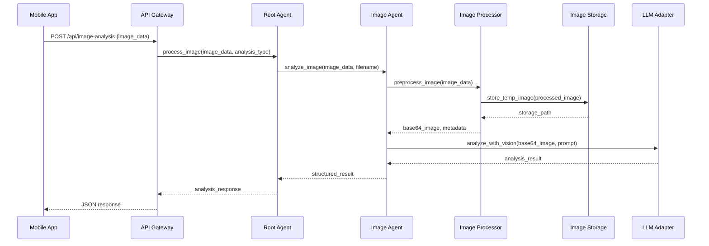

# HRM Agent 시스템 Component & Connector View

## 개요

Component & Connector (C&C) View는 런타임 시스템의 구조를 보여줍니다. 컴포넌트들이 어떻게 상호작용하고, 데이터가 어떻게 흐르며, 제어가 어떻게 전달되는지를 나타냅니다.

## 전체 C&C 아키텍처

```mermaid
graph TB
    subgraph "Client Tier"
        WebBrowser[Web Browser<br/>Component]
        MobileApp[Mobile App<br/>Component]
        APIClient[API Client<br/>Component]
    end
    
    subgraph "Presentation Tier"
        WebServer[Web Server<br/>Flask App<br/>Port 5000]
        LoadBalancer["Load Balancer<br/>Component<br/>Future"]
    end
    
    subgraph "API Gateway Tier"
        APIGateway[API Gateway<br/>HRM Agent API<br/>Port 8000]
        RateLimiter["Rate Limiter<br/>Component<br/>Future"]
        AuthService["Auth Service<br/>Component<br/>Future"]
    end
    
    subgraph "Business Logic Tier"
        RootAgent[Root Agent<br/>Orchestrator<br/>Component]
        MCPRegistry[MCP Registry<br/>Component]
        
        subgraph "Agent Pool"
            DiagAgent[Diagnosis<br/>Summarizer<br/>Component]
            OpAgent[Operation History<br/>Summarizer<br/>Component]
            GuideAgent[Guide Provider<br/>Component]
            ImageAgent[Image Analyzer<br/>Component]
        end
        
        subgraph "Supporting Services"
            PromptBuilder[Prompt Builder<br/>Service Component]
            Guardrails[Guardrails<br/>Service Component]
            Logger[Logger<br/>Service Component]
        end
    end
    
    subgraph "Integration Tier"
        LLMAdapter[LLM Adapter<br/>Component]
        GuideRetriever[Guide Retriever<br/>Component]
        FileManager[File Manager<br/>Component]
        ImageProcessor[Image Processor<br/>Component]
    end
    
    subgraph "External Services"
        OpenAI[OpenAI API<br/>External Component]
        Bedrock[AWS Bedrock<br/>External Component]
        Gauss[Gauss API<br/>External Component]
        GuideAPI[Guide API<br/>External Component<br/>Port 5001]
        LangSmith[LangSmith<br/>External Component]
        FileSystem[File System<br/>External Component]
        ImageStorage[Image Storage<br/>External Component]
    end
    
    %% Client to Presentation Connectors
    WebBrowser -->|"HTTP/HTTPS<br/>Request-Response"| WebServer
    MobileApp -->|"REST API<br/>Request-Response"| APIGateway
    APIClient -->|"REST API<br/>Request-Response"| APIGateway
    
    %% Presentation to API Gateway Connectors
    WebServer -->|"HTTP Proxy<br/>Request-Response"| APIGateway
    LoadBalancer -->|"HTTP<br/>Load Distribution"| WebServer
    
    %% API Gateway Tier Connectors
    APIGateway -->|"Request Validation<br/>Synchronous Call"| RateLimiter
    APIGateway -->|"Authentication<br/>Synchronous Call"| AuthService
    APIGateway -->|"Business Logic<br/>Synchronous Call"| RootAgent
    
    %% Business Logic Tier Connectors
    RootAgent -->|"Agent Management<br/>Registry Pattern"| MCPRegistry
    RootAgent -->|"Task Delegation<br/>Command Pattern"| DiagAgent
    RootAgent -->|"Task Delegation<br/>Command Pattern"| OpAgent
    RootAgent -->|"Task Delegation<br/>Command Pattern"| GuideAgent
    RootAgent -->|"Task Delegation<br/>Command Pattern"| ImageAgent
    
    %% Agent to Supporting Services Connectors
    DiagAgent -->|"Prompt Generation<br/>Service Call"| PromptBuilder
    DiagAgent -->|"Input/Output Validation<br/>Pipeline Pattern"| Guardrails
    DiagAgent -->|"Event Logging<br/>Observer Pattern"| Logger
    
    OpAgent -->|"Prompt Generation<br/>Service Call"| PromptBuilder
    OpAgent -->|"Input/Output Validation<br/>Pipeline Pattern"| Guardrails
    OpAgent -->|"Event Logging<br/>Observer Pattern"| Logger
    
    GuideAgent -->|"Prompt Generation<br/>Service Call"| PromptBuilder
    GuideAgent -->|"Input/Output Validation<br/>Pipeline Pattern"| Guardrails
    GuideAgent -->|"Event Logging<br/>Observer Pattern"| Logger
    
    ImageAgent -->|"Prompt Generation<br/>Service Call"| PromptBuilder
    ImageAgent -->|"Input/Output Validation<br/>Pipeline Pattern"| Guardrails
    ImageAgent -->|"Event Logging<br/>Observer Pattern"| Logger
    ImageAgent -->|"Image Processing<br/>Service Call"| ImageProcessor
    
    %% Integration Tier Connectors
    DiagAgent -->|"LLM Invocation<br/>Adapter Pattern"| LLMAdapter
    OpAgent -->|"LLM Invocation<br/>Adapter Pattern"| LLMAdapter
    GuideAgent -->|"LLM Invocation<br/>Adapter Pattern"| LLMAdapter
    GuideAgent -->|"Document Retrieval<br/>Service Call"| GuideRetriever
    ImageAgent -->|"LLM Invocation<br/>Adapter Pattern"| LLMAdapter
    
    RootAgent -->|"Configuration Access<br/>Repository Pattern"| FileManager
    Logger -->|"Log Persistence<br/>Repository Pattern"| FileManager
    
    %% External Service Connectors
    LLMAdapter -->|"API Call<br/>HTTP/REST"| OpenAI
    LLMAdapter -->|"API Call<br/>HTTP/REST"| Bedrock
    LLMAdapter -->|"API Call<br/>HTTP/REST"| Gauss
    GuideRetriever -->|"Search Request<br/>HTTP/REST"| GuideAPI
    Logger -->|"Trace Data<br/>HTTP/REST"| LangSmith
    FileManager -->|"File I/O<br/>File System API"| FileSystem
    ImageProcessor -->|"Image Storage<br/>File System API"| ImageStorage
    
    %% Styling
    classDef clientComp fill:#e3f2fd,stroke:#1976d2,stroke-width:2px
    classDef presentationComp fill:#f3e5f5,stroke:#7b1fa2,stroke-width:2px
    classDef apiComp fill:#fff3e0,stroke:#f57c00,stroke-width:2px
    classDef businessComp fill:#e8f5e8,stroke:#388e3c,stroke-width:2px
    classDef integrationComp fill:#fff8e1,stroke:#fbc02d,stroke-width:2px
    classDef externalComp fill:#ffebee,stroke:#d32f2f,stroke-width:2px
    
    class WebBrowser,MobileApp,APIClient clientComp
    class WebServer,LoadBalancer presentationComp
    class APIGateway,RateLimiter,AuthService apiComp
    class RootAgent,MCPRegistry,DiagAgent,OpAgent,GuideAgent,ImageAgent,PromptBuilder,Guardrails,Logger businessComp
    class LLMAdapter,GuideRetriever,FileManager,ImageProcessor integrationComp
    class OpenAI,Bedrock,Gauss,GuideAPI,LangSmith,FileSystem,ImageStorage externalComp
```

## 컴포넌트 상세 설명

### Client Tier Components

#### Web Browser Component
- **타입**: User Interface Component
- **책임**: 사용자 인터페이스 제공, 사용자 입력 처리
- **인터페이스**: 
  - Provided: User Interaction Interface
  - Required: HTTP Client Interface
- **품질 속성**: 사용성, 응답성, 접근성

#### Mobile App Component  
- **타입**: User Interface Component
- **책임**: 모바일 사용자 인터페이스, 오프라인 기능
- **인터페이스**:
  - Provided: Mobile User Interface
  - Required: REST API Client Interface
- **품질 속성**: 성능, 사용성, 가용성

### Presentation Tier Components

#### Web Server Component
- **타입**: Presentation Component
- **책임**: HTTP 요청 처리, 템플릿 렌더링, 정적 리소스 제공
- **인터페이스**:
  - Provided: HTTP Server Interface
  - Required: API Client Interface, Template Engine Interface
- **품질 속성**: 성능, 확장성, 보안성

#### Load Balancer Component [Future]
- **타입**: Infrastructure Component
- **책임**: 트래픽 분산, 헬스 체크, 장애 조치
- **인터페이스**:
  - Provided: Load Distribution Interface
  - Required: Server Health Interface
- **품질 속성**: 가용성, 성능, 확장성

### API Gateway Tier Components

#### API Gateway Component
- **타입**: Service Component
- **책임**: API 엔드포인트 제공, 요청 라우팅, 응답 처리
- **인터페이스**:
  - Provided: REST API Interface
  - Required: Business Logic Interface
- **품질 속성**: 성능, 보안성, 신뢰성

#### Rate Limiter Component [Future]
- **타입**: Infrastructure Component  
- **책임**: API 호출 제한, DoS 공격 방지
- **인터페이스**:
  - Provided: Rate Limiting Interface
  - Required: Request Counter Interface
- **품질 속성**: 보안성, 성능

### Business Logic Tier Components

#### Root Agent Component
- **타입**: Orchestrator Component
- **책임**: 에이전트 오케스트레이션, 워크플로우 관리
- **인터페이스**:
  - Provided: Agent Orchestration Interface
  - Required: Agent Management Interface, Configuration Interface
- **품질 속성**: 확장성, 유지보수성, 신뢰성

#### Agent Components [Diagnosis, Operation History, Guide, Image]
- **타입**: Business Logic Component
- **책임**: 도메인별 비즈니스 로직 처리
- **인터페이스**:
  - Provided: Domain Processing Interface
  - Required: LLM Interface, Validation Interface
- **품질 속성**: 정확성, 성능, 확장성

### Integration Tier Components

#### LLM Adapter Component
- **타입**: Adapter Component
- **책임**: 다양한 LLM 서비스와의 통합, 프로토콜 변환
- **인터페이스**:
  - Provided: Unified LLM Interface
  - Required: Provider-specific API Interfaces
- **품질 속성**: 상호운용성, 확장성, 신뢰성

## 커넥터 상세 설명

### HTTP/HTTPS Request-Response Connector
- **타입**: Request-Response Connector
- **프로토콜**: HTTP/HTTPS
- **품질 속성**: 신뢰성, 보안성
- **패턴**: Synchronous Communication

### REST API Connector
- **타입**: Remote Procedure Call Connector
- **프로토콜**: HTTP + JSON
- **품질 속성**: 상호운용성, 확장성
- **패턴**: Request-Response

### Service Call Connector
- **타입**: Procedure Call Connector
- **프로토콜**: In-process method call
- **품질 속성**: 성능, 신뢰성
- **패턴**: Synchronous Call

### Event-based Connector
- **타입**: Event Connector
- **프로토콜**: Observer Pattern
- **품질 속성**: 느슨한 결합, 확장성
- **패턴**: Publish-Subscribe

## 런타임 시나리오

### 1. 진단 요약 생성 시나리오

### 2. 이미지 분석 시나리오

## 품질 속성 분석

### 성능 [Performance]
- **응답 시간**: 평균 < 3초, 스트리밍 첫 응답 < 1초
- **처리량**: 동시 사용자 100명 지원
- **리소스 사용량**: CPU < 70%, 메모리 < 4GB

### 확장성 [Scalability]
- **수평적 확장**: 로드 밸런서를 통한 인스턴스 추가
- **수직적 확장**: 하드웨어 리소스 증설
- **컴포넌트별 독립 확장**: 각 티어별 독립적 스케일링

### 가용성 [Availability]
- **목표**: 99.9% 가동률
- **장애 복구**: 자동 재시작, 헬스 체크
- **백업**: 설정 및 데이터 백업

### 보안성 [Security]
- **인증**: API 키 기반, 향후 OAuth 2.0
- **인가**: 역할 기반 접근 제어, 향후 구현
- **데이터 보호**: HTTPS 통신, 민감 정보 암호화

### 상호운용성 [Interoperability]
- **표준 프로토콜**: HTTP/REST, JSON
- **API 호환성**: OpenAPI 3.0 스펙 준수
- **다양한 클라이언트**: 웹, 모바일, API 클라이언트 지원

## 배포 및 운영 고려사항

### 컴포넌트 배치
- **단일 서버**: 개발/테스트 환경
- **다중 서버**: 프로덕션 환경
- **컨테이너**: Docker를 통한 컴포넌트 격리

### 모니터링
- **헬스 체크**: 각 컴포넌트별 상태 확인
- **메트릭 수집**: 성능, 에러, 사용량 데이터
- **로그 집계**: 중앙화된 로그 관리

### 장애 대응
- **Circuit Breaker**: 외부 서비스 장애 시 차단
- **Retry Logic**: 일시적 장애 시 재시도
- **Graceful Degradation**: 부분 기능 장애 시 서비스 계속 제공
