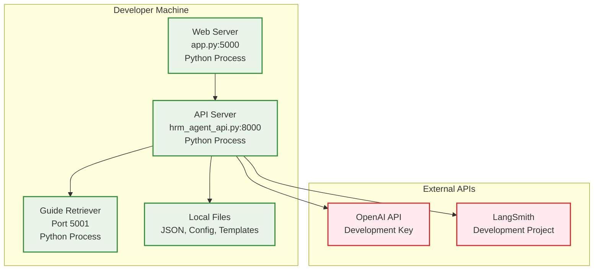
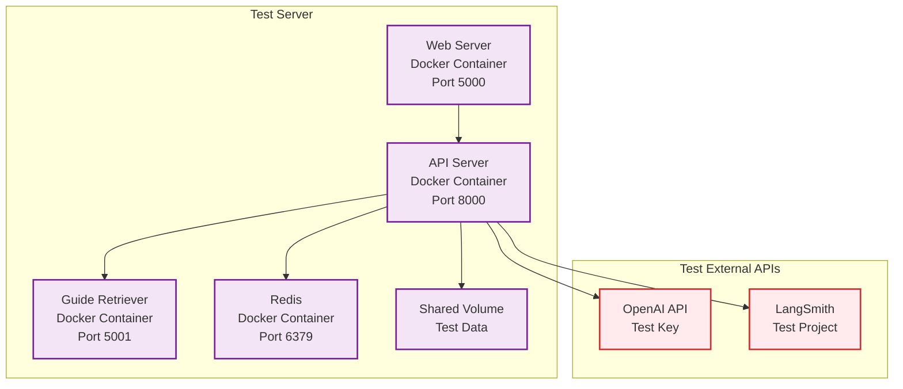
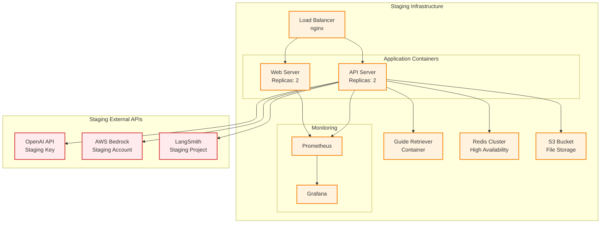
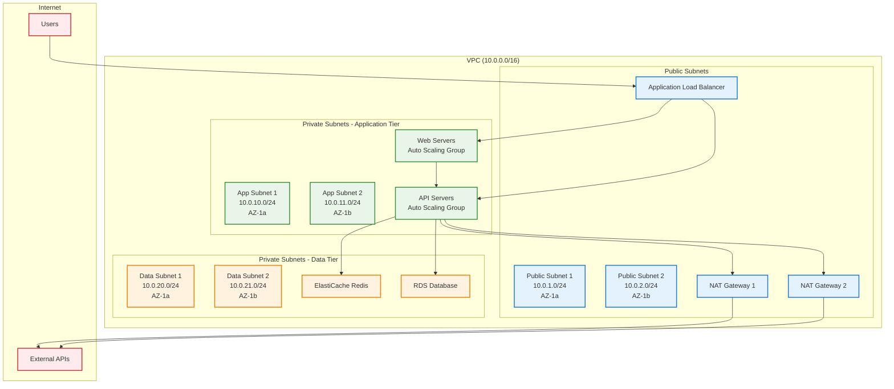

# HRM Agent 시스템 Deployment View

## 개요

Deployment View는 시스템이 실제 하드웨어와 네트워크 인프라에 어떻게 배포되는지를 보여줍니다. 개발, 테스트, 스테이징, 프로덕션 환경에서의 배포 전략과 인프라 구성을 다룹니다.

## 전체 배포 아키텍처

```mermaid
graph TB
    subgraph "Internet"
        Users[사용자들<br/>Users]
        CDN[Content Delivery Network<br/>CloudFront/CloudFlare]
    end
    
    subgraph "DMZ (Demilitarized Zone)"
        LoadBalancer[Load Balancer<br/>nginx/HAProxy]
        WAF[Web Application Firewall<br/>AWS WAF/CloudFlare]
        SSL[SSL Termination<br/>Let's Encrypt]
    end
    
    subgraph "Application Tier"
        subgraph "Web Servers"
            WebServer1[Web Server 1<br/>app.py:5000<br/>Docker Container]
            WebServer2[Web Server 2<br/>app.py:5000<br/>Docker Container]
        end
        
        subgraph "API Servers"
            APIServer1[API Server 1<br/>hrm_agent_api.py:8000<br/>Docker Container]
            APIServer2[API Server 2<br/>hrm_agent_api.py:8000<br/>Docker Container]
        end
    end
    
    subgraph "Service Tier"
        GuideRetriever[Guide Retriever API<br/>Port 5001<br/>Docker Container]
        Redis[Redis Cache<br/>Session & Data Cache]
        FileStorage[File Storage<br/>NFS/S3 Mount]
    end
    
    subgraph "External Services"
        OpenAI[OpenAI API<br/>api.openai.com]
        Bedrock[AWS Bedrock<br/>bedrock.amazonaws.com]
        Gauss[Gauss API<br/>gauss.ai]
        LangSmith[LangSmith<br/>smith.langchain.com]
    end
    
    subgraph "Monitoring & Logging"
        Prometheus[Prometheus<br/>Metrics Collection]
        Grafana[Grafana<br/>Monitoring Dashboard]
        ELK[ELK Stack<br/>Elasticsearch, Logstash, Kibana]
    end
    
    subgraph "Infrastructure"
        Docker[Docker Engine<br/>Container Runtime]
        K8s[Kubernetes<br/>Orchestration Platform<br/>(Future)]
    end
    
    %% User Traffic Flow
    Users --> CDN
    CDN --> WAF
    WAF --> SSL
    SSL --> LoadBalancer
    
    %% Load Distribution
    LoadBalancer --> WebServer1
    LoadBalancer --> WebServer2
    LoadBalancer --> APIServer1
    LoadBalancer --> APIServer2
    
    %% Internal Communication
    WebServer1 --> APIServer1
    WebServer1 --> APIServer2
    WebServer2 --> APIServer1
    WebServer2 --> APIServer2
    
    %% Service Dependencies
    APIServer1 --> GuideRetriever
    APIServer2 --> GuideRetriever
    APIServer1 --> Redis
    APIServer2 --> Redis
    APIServer1 --> FileStorage
    APIServer2 --> FileStorage
    
    %% External API Calls
    APIServer1 --> OpenAI
    APIServer1 --> Bedrock
    APIServer1 --> Gauss
    APIServer1 --> LangSmith
    APIServer2 --> OpenAI
    APIServer2 --> Bedrock
    APIServer2 --> Gauss
    APIServer2 --> LangSmith
    
    %% Monitoring
    WebServer1 --> Prometheus
    WebServer2 --> Prometheus
    APIServer1 --> Prometheus
    APIServer2 --> Prometheus
    GuideRetriever --> Prometheus
    
    Prometheus --> Grafana
    
    WebServer1 --> ELK
    WebServer2 --> ELK
    APIServer1 --> ELK
    APIServer2 --> ELK
    
    %% Container Platform
    WebServer1 --> Docker
    WebServer2 --> Docker
    APIServer1 --> Docker
    APIServer2 --> Docker
    GuideRetriever --> Docker
    
    Docker --> K8s
    
    %% Styling
    classDef userLayer fill:#e3f2fd,stroke:#1976d2,stroke-width:2px
    classDef dmzLayer fill:#fff3e0,stroke:#f57c00,stroke-width:2px
    classDef appLayer fill:#e8f5e8,stroke:#388e3c,stroke-width:2px
    classDef serviceLayer fill:#f3e5f5,stroke:#7b1fa2,stroke-width:2px
    classDef externalLayer fill:#ffebee,stroke:#d32f2f,stroke-width:2px
    classDef monitorLayer fill:#fff8e1,stroke:#fbc02d,stroke-width:2px
    classDef infraLayer fill:#e0f2f1,stroke:#00796b,stroke-width:2px
    
    class Users,CDN userLayer
    class LoadBalancer,WAF,SSL dmzLayer
    class WebServer1,WebServer2,APIServer1,APIServer2 appLayer
    class GuideRetriever,Redis,FileStorage serviceLayer
    class OpenAI,Bedrock,Gauss,LangSmith externalLayer
    class Prometheus,Grafana,ELK monitorLayer
    class Docker,K8s infraLayer
```

## 환경별 배포 전략

### 개발 환경 (Development)



**특징:**
- 단일 머신에서 모든 컴포넌트 실행
- 로컬 파일 시스템 사용
- 개발용 API 키 사용
- Hot reload 지원

**실행 방법:**
```bash
# Terminal 1
python run_api_server.py

# Terminal 2  
python run_web_server.py

# Terminal 3 (Guide Retriever)
python -m guide_retriever_server
```

### 테스트 환경 (Testing)



**특징:**
- Docker Compose를 통한 컨테이너 오케스트레이션
- 테스트용 Redis 캐시
- 공유 볼륨을 통한 데이터 관리
- 자동화된 테스트 실행

**Docker Compose 설정:**
```yaml
version: '3.8'
services:
  web-server:
    build: .
    command: python app.py
    ports:
      - "5000:5000"
    depends_on:
      - api-server
    environment:
      - HRM_AGENT_API_URL=http://api-server:8000
      
  api-server:
    build: .
    command: python hrm_agent_api.py
    ports:
      - "8000:8000"
    depends_on:
      - redis
      - guide-retriever
    volumes:
      - ./data:/app/data
      - ./configure.json:/app/configure.json
      
  guide-retriever:
    build: ./guide_retriever
    ports:
      - "5001:5001"
      
  redis:
    image: redis:7-alpine
    ports:
      - "6379:6379"
```

### 스테이징 환경 (Staging)



**특징:**
- 프로덕션과 동일한 아키텍처
- 고가용성 구성 (로드 밸런서, 복제본)
- 모니터링 및 로깅 시스템
- 자동 배포 파이프라인

### 프로덕션 환경 (Production)

```mermaid
graph TB
    subgraph "Production Infrastructure - AWS/Azure/GCP"
        subgraph "Edge Layer"
            ProdCDN[CloudFront CDN]
            ProdWAF[AWS WAF]
        end
        
        subgraph "Load Balancer Tier"
            ProdALB[Application Load Balancer<br/>Multi-AZ]
        end
        
        subgraph "Application Tier - Auto Scaling Groups"
            subgraph "Web Tier"
                ProdWeb1[Web Server 1<br/>ECS/EKS Container]
                ProdWeb2[Web Server 2<br/>ECS/EKS Container]
                ProdWebN[Web Server N<br/>Auto Scaling]
            end
            
            subgraph "API Tier"
                ProdAPI1[API Server 1<br/>ECS/EKS Container]
                ProdAPI2[API Server 2<br/>ECS/EKS Container]
                ProdAPIN[API Server N<br/>Auto Scaling]
            end
        end
        
        subgraph "Service Tier"
            ProdGuide[Guide Retriever<br/>ECS Service]
            ProdElastiCache[ElastiCache Redis<br/>Cluster Mode]
            ProdS3[S3 Bucket<br/>File Storage]
            ProdRDS[RDS Database<br/>Multi-AZ<br/>(Future)]
        end
        
        subgraph "Monitoring & Logging"
            ProdCloudWatch[CloudWatch<br/>Metrics & Logs]
            ProdXRay[X-Ray<br/>Distributed Tracing]
            ProdDatadog[Datadog<br/>APM & Monitoring]
        end
    end
    
    subgraph "External Services"
        ProdOpenAI[OpenAI API<br/>Production Key]
        ProdBedrock[AWS Bedrock<br/>Production Account]
        ProdGauss[Gauss API<br/>Production Key]
        ProdLangSmith[LangSmith<br/>Production Project]
    end
    
    %% Traffic Flow
    ProdCDN --> ProdWAF
    ProdWAF --> ProdALB
    
    ProdALB --> ProdWeb1
    ProdALB --> ProdWeb2
    ProdALB --> ProdWebN
    ProdALB --> ProdAPI1
    ProdALB --> ProdAPI2
    ProdALB --> ProdAPIN
    
    %% Internal Services
    ProdWeb1 --> ProdAPI1
    ProdWeb2 --> ProdAPI2
    
    ProdAPI1 --> ProdGuide
    ProdAPI2 --> ProdGuide
    ProdAPI1 --> ProdElastiCache
    ProdAPI2 --> ProdElastiCache
    ProdAPI1 --> ProdS3
    ProdAPI2 --> ProdS3
    
    %% External APIs
    ProdAPI1 --> ProdOpenAI
    ProdAPI1 --> ProdBedrock
    ProdAPI1 --> ProdGauss
    ProdAPI1 --> ProdLangSmith
    
    %% Monitoring
    ProdWeb1 --> ProdCloudWatch
    ProdAPI1 --> ProdCloudWatch
    ProdAPI1 --> ProdXRay
    ProdWeb1 --> ProdDatadog
    ProdAPI1 --> ProdDatadog
    
    %% Styling
    classDef prodComp fill:#e3f2fd,stroke:#1976d2,stroke-width:2px
    classDef extComp fill:#ffebee,stroke:#d32f2f,stroke-width:2px
    
    class ProdCDN,ProdWAF,ProdALB,ProdWeb1,ProdWeb2,ProdWebN,ProdAPI1,ProdAPI2,ProdAPIN,ProdGuide,ProdElastiCache,ProdS3,ProdRDS,ProdCloudWatch,ProdXRay,ProdDatadog prodComp
    class ProdOpenAI,ProdBedrock,ProdGauss,ProdLangSmith extComp
```

**특징:**
- 클라우드 네이티브 아키텍처
- 자동 확장 (Auto Scaling)
- 고가용성 (Multi-AZ 배포)
- 완전 관리형 서비스 활용
- 포괄적 모니터링 및 알림

## 컨테이너 배포 전략

### Docker 이미지 구성

#### Base Image
```dockerfile
FROM python:3.9-slim

# 시스템 의존성 설치
RUN apt-get update && apt-get install -y \
    gcc \
    && rm -rf /var/lib/apt/lists/*

# 작업 디렉토리 설정
WORKDIR /app

# Python 의존성 설치
COPY requirements.txt .
RUN pip install --no-cache-dir -r requirements.txt

# 애플리케이션 코드 복사
COPY . .

# 비root 사용자 생성
RUN useradd -m -u 1000 appuser && chown -R appuser:appuser /app
USER appuser

# 포트 노출
EXPOSE 5000 8000

# 헬스 체크
HEALTHCHECK --interval=30s --timeout=10s --start-period=30s --retries=3 \
  CMD curl -f http://localhost:8000/health || exit 1
```

#### Web Server Image
```dockerfile
FROM hrm-agent:base

CMD ["python", "app.py"]
EXPOSE 5000
```

#### API Server Image
```dockerfile
FROM hrm-agent:base

CMD ["python", "hrm_agent_api.py"]
EXPOSE 8000
```

### Kubernetes 배포 (향후)

#### Deployment 구성
```yaml
apiVersion: apps/v1
kind: Deployment
metadata:
  name: hrm-agent-api
spec:
  replicas: 3
  selector:
    matchLabels:
      app: hrm-agent-api
  template:
    metadata:
      labels:
        app: hrm-agent-api
    spec:
      containers:
      - name: api-server
        image: hrm-agent-api:latest
        ports:
        - containerPort: 8000
        env:
        - name: OPENAI_API_KEY
          valueFrom:
            secretKeyRef:
              name: api-keys
              key: openai-key
        resources:
          requests:
            memory: "512Mi"
            cpu: "250m"
          limits:
            memory: "1Gi"
            cpu: "500m"
        livenessProbe:
          httpGet:
            path: /health
            port: 8000
          initialDelaySeconds: 30
          periodSeconds: 10
        readinessProbe:
          httpGet:
            path: /health
            port: 8000
          initialDelaySeconds: 5
          periodSeconds: 5
```

#### Service 구성
```yaml
apiVersion: v1
kind: Service
metadata:
  name: hrm-agent-api-service
spec:
  selector:
    app: hrm-agent-api
  ports:
    - protocol: TCP
      port: 8000
      targetPort: 8000
  type: LoadBalancer
```

## 네트워크 구성

### 보안 그룹 (AWS Security Groups)

#### Web Tier Security Group
```
Inbound Rules:
- HTTP (80) from ALB Security Group
- HTTPS (443) from ALB Security Group

Outbound Rules:
- HTTP (8000) to API Tier Security Group
- HTTPS (443) to Internet (for external APIs)
```

#### API Tier Security Group
```
Inbound Rules:
- HTTP (8000) from Web Tier Security Group
- HTTP (8000) from ALB Security Group

Outbound Rules:
- HTTP (5001) to Service Tier Security Group
- Redis (6379) to Service Tier Security Group
- HTTPS (443) to Internet (for external APIs)
```

#### Service Tier Security Group
```
Inbound Rules:
- HTTP (5001) from API Tier Security Group
- Redis (6379) from API Tier Security Group

Outbound Rules:
- HTTPS (443) to Internet (if needed)
```

### 네트워크 토폴로지



## 배포 파이프라인

### CI/CD 파이프라인

```mermaid
graph LR
    subgraph "Source Control"
        GitHub[GitHub Repository]
    end
    
    subgraph "CI Pipeline"
        GitHubActions[GitHub Actions]
        UnitTest[Unit Tests]
        IntegrationTest[Integration Tests]
        SecurityScan[Security Scan]
        Build[Docker Build]
        Registry[Container Registry]
    end
    
    subgraph "CD Pipeline"
        Deploy[Deploy to Staging]
        E2ETest[E2E Tests]
        Approval[Manual Approval]
        ProdDeploy[Deploy to Production]
    end
    
    subgraph "Monitoring"
        HealthCheck[Health Checks]
        Rollback[Automatic Rollback]
        Alerts[Alerts & Notifications]
    end
    
    GitHub --> GitHubActions
    GitHubActions --> UnitTest
    UnitTest --> IntegrationTest
    IntegrationTest --> SecurityScan
    SecurityScan --> Build
    Build --> Registry
    
    Registry --> Deploy
    Deploy --> E2ETest
    E2ETest --> Approval
    Approval --> ProdDeploy
    
    ProdDeploy --> HealthCheck
    HealthCheck --> Rollback
    HealthCheck --> Alerts
    
    %% Styling
    classDef sourceStage fill:#e8f5e8,stroke:#388e3c,stroke-width:2px
    classDef ciStage fill:#e3f2fd,stroke:#1976d2,stroke-width:2px
    classDef cdStage fill:#fff3e0,stroke:#f57c00,stroke-width:2px
    classDef monitorStage fill:#f3e5f5,stroke:#7b1fa2,stroke-width:2px
    
    class GitHub sourceStage
    class GitHubActions,UnitTest,IntegrationTest,SecurityScan,Build,Registry ciStage
    class Deploy,E2ETest,Approval,ProdDeploy cdStage
    class HealthCheck,Rollback,Alerts monitorStage
```



### 배포 전략

#### Blue-Green 배포
- 두 개의 동일한 프로덕션 환경 유지
- 새 버전을 Green 환경에 배포
- 트래픽을 Blue에서 Green으로 전환
- 문제 발생 시 즉시 Blue로 롤백

#### Rolling 배포
- 인스턴스를 점진적으로 업데이트
- 서비스 중단 없이 배포
- 각 단계에서 헬스 체크 수행
- 문제 발생 시 롤백

#### Canary 배포
- 소량의 트래픽을 새 버전으로 라우팅
- 메트릭 모니터링을 통한 검증
- 점진적으로 트래픽 비율 증가
- A/B 테스트 지원

## 모니터링 및 관찰성

### 메트릭 수집
- **애플리케이션 메트릭**: 응답 시간, 에러율, 처리량
- **인프라 메트릭**: CPU, 메모리, 디스크, 네트워크
- **비즈니스 메트릭**: API 호출 수, 사용자 수, 기능 사용률

### 로그 관리
- **구조화된 로깅**: JSON 형식으로 표준화
- **중앙집중식 로그 수집**: ELK Stack 또는 CloudWatch
- **로그 레벨 관리**: DEBUG, INFO, WARN, ERROR
- **민감 정보 마스킹**: PII 데이터 보호

### 알림 및 경고
- **임계값 기반 알림**: CPU, 메모리, 응답 시간
- **에러율 알림**: 5xx 에러 급증 시
- **외부 API 장애 알림**: 의존성 서비스 장애
- **비즈니스 메트릭 알림**: 사용량 급증/급감

## 보안 및 컴플라이언스

### 보안 조치
- **네트워크 보안**: VPC, 보안 그룹, NACL
- **애플리케이션 보안**: WAF, 입력 검증, 출력 인코딩
- **데이터 보안**: 전송 중/저장 시 암호화
- **접근 제어**: IAM, RBAC, 최소 권한 원칙

### 컴플라이언스
- **데이터 보호**: GDPR, 개인정보보호법 준수
- **감사 로그**: 모든 중요 작업 기록
- **데이터 보존**: 정책에 따른 데이터 삭제
- **정기 보안 검토**: 취약점 스캔, 침투 테스트

## 재해 복구 및 백업

### 백업 전략
- **데이터 백업**: 일일 자동 백업, 7일 보존
- **설정 백업**: Infrastructure as Code (Terraform)
- **이미지 백업**: 컨테이너 이미지 버전 관리
- **지역 간 복제**: 재해 복구를 위한 다중 리전

### 복구 계획
- **RTO (Recovery Time Objective)**: 4시간 이내
- **RPO (Recovery Point Objective)**: 1시간 이내
- **자동 장애 조치**: 헬스 체크 기반
- **수동 복구 절차**: 단계별 복구 가이드
