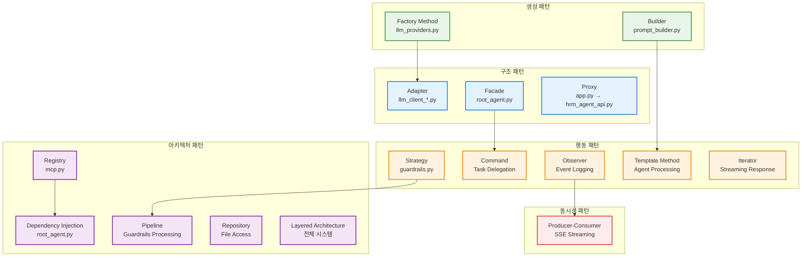

# HRM Agent 시스템 디자인 패턴 정리

## 개요

HRM Agent 시스템에서 사용된 주요 디자인 패턴들을 카테고리별로 정리하고, 각 패턴이 어디에 어떻게 적용되었는지 상세히 설명합니다.

## 생성 패턴 (Creational Patterns)

### 1. Factory Method Pattern

#### 적용 위치: `agents/llm_providers.py`
```python
def build_llm(provider: str, **kwargs: Any) -> LLMClient:
    key = (provider or "").lower()
    if key in ("openai", "oai"):
        return OpenAIClient(model=kwargs.get("model"), api_key=kwargs.get("api_key"))
    if key in ("bedrock", "aws"):
        return BedrockClient(model_id=kwargs.get("model_id"), region=kwargs.get("region"))
    if key in ("gauss",):
        return GaussClient(access_key=kwargs.get("access_key"), secret_key=kwargs.get("secret_key"))
    if key in ("gausso", "gauss_o", "gauss-vision"):
        return GaussOClient(access_key=kwargs.get("access_key"), secret_key=kwargs.get("secret_key"))
    raise ValueError(f"Unsupported LLM provider: {provider}")
```

**목적**: 
- 다양한 LLM 프로바이더(OpenAI, Bedrock, Gauss, GaussO)에 대한 클라이언트 객체 생성
- 런타임에 설정에 따라 적절한 LLM 클라이언트 선택

**장점**:
- 새로운 LLM 프로바이더 추가 시 기존 코드 수정 없이 확장 가능
- 클라이언트 코드는 구체적인 LLM 클라이언트 클래스를 알 필요 없음

### 2. Builder Pattern

#### 적용 위치: `agents/prompt_builder.py`
```python
class PromptBuilder:
    def build_diagnosis_prompt(self, device_type: str, diagnosis_text: str, provider: str, language: str) -> str:
        # 진단 프롬프트 구성
    
    def build_operation_history_prompt(self, operation_history: dict, provider: str, language: str) -> str:
        # 운영 이력 프롬프트 구성
    
    def build_guide_prompt(self, diagnosis_summary: str, op_summary: str, provider: str, language: str) -> str:
        # 가이드 프롬프트 구성
    
    def build_actions_guide_prompt(self, diagnosis_summary: str, retrieved_documents: str, language: str) -> str:
        # 액션 가이드 프롬프트 구성
```

**목적**:
- 복잡한 프롬프트를 단계별로 구성
- 다양한 유형의 프롬프트를 일관된 방식으로 생성

**장점**:
- 프롬프트 구성 로직의 재사용성
- 프롬프트 템플릿의 중앙 집중 관리

## 구조 패턴 (Structural Patterns)

### 3. Adapter Pattern

#### 적용 위치: `agents/llm_client_*.py` (모든 LLM 클라이언트들)
```python
# agents/llm_client_base.py
class LLMClient(Protocol):
    def generate(self, prompt: str, stream: bool = False) -> Union[str, Generator[StreamingChunk, None, None]]:
        ...

# agents/llm_client_openai.py  
class OpenAIClient:
    def generate(self, prompt: str, stream: bool = False):
        # OpenAI API를 공통 인터페이스로 변환
        
# agents/llm_client_bedrock.py
class BedrockClient:
    def generate(self, prompt: str, stream: bool = False):
        # AWS Bedrock API를 공통 인터페이스로 변환
```

**목적**:
- 서로 다른 LLM API들을 공통된 인터페이스로 통합
- 각 LLM 서비스의 고유한 API를 시스템 표준 인터페이스로 변환

**장점**:
- 다양한 LLM 서비스를 동일한 방식으로 사용 가능
- 새로운 LLM 서비스 추가 시 기존 코드 영향 최소화

### 4. Facade Pattern

#### 적용 위치: `agents/root_agent.py`
```python
class RootAgent:
    def run_diagnosis(self, analytics: Dict[str, Any], language: Optional[str] = None):
        # 진단 요약을 위한 복잡한 서브시스템 조정
        
    def run_op_history(self, operation_history: Dict[str, Any], language: Optional[str] = None):
        # 운영 이력 요약을 위한 복잡한 서브시스템 조정
        
    def run_actions_guide(self, diagnosis_summary: str, category: str, language: Optional[str] = None):
        # 액션 가이드 생성을 위한 복잡한 서브시스템 조정
```

**목적**:
- 복잡한 에이전트 서브시스템들을 단순한 인터페이스로 통합
- 클라이언트가 개별 에이전트들과 직접 상호작용하지 않도록 추상화

**장점**:
- 시스템 사용의 복잡성 감소
- 서브시스템 변경이 클라이언트에 미치는 영향 최소화

### 5. Proxy Pattern

#### 적용 위치: `app.py` (웹 서버가 API 서버에 대한 프록시 역할)
```python
# app.py에서 hrm_agent_api.py로의 프록시 호출
def stream_diagnosis(item_id):
    # HRM Agent API 서버로 요청 프록시
    response = requests.post(
        f"{HRM_AGENT_API_URL}/api/diagnosis/stream",
        json=api_payload,
        stream=True,
        timeout=300
    )
```

**목적**:
- 웹 UI와 실제 AI 서비스 간의 중간 계층 제공
- 요청 전처리, 인증, 캐싱 등의 부가 기능 제공

**장점**:
- 클라이언트와 서버 간의 느슨한 결합
- 부가 기능(로깅, 캐싱, 보안)을 투명하게 추가 가능

## 행동 패턴 (Behavioral Patterns)

### 6. Strategy Pattern

#### 적용 위치: `agents/guardrails.py`
```python
class Guardrail:
    def pre_guard(self, payload: dict) -> dict:
        # 기본 전처리 전략
        
    def post_guard(self, output: str) -> str:
        # 기본 후처리 전략

class DiagnosisGuardrail(Guardrail):
    # 진단 전용 검증 전략
    
class OperationHistoryGuardrail(Guardrail):
    # 운영 이력 전용 검증 전략
    
class GuideGuardrail(Guardrail):
    # 가이드 전용 검증 전략
```

**목적**:
- 각 에이전트별로 다른 검증 및 후처리 전략 적용
- 런타임에 적절한 가드레일 전략 선택

**장점**:
- 검증 로직의 캡슐화 및 교체 가능성
- 새로운 검증 전략 추가 시 기존 코드 수정 불필요

### 7. Command Pattern

#### 적용 위치: `documents/component_connector_view.md`에서 언급된 Task Delegation
```python
# RootAgent에서 각 에이전트로의 작업 위임
RootAgent -->|"Task Delegation<br/>Command Pattern"| DiagAgent
RootAgent -->|"Task Delegation<br/>Command Pattern"| OpAgent
RootAgent -->|"Task Delegation<br/>Command Pattern"| GuideAgent
RootAgent -->|"Task Delegation<br/>Command Pattern"| ImageAgent
```

**목적**:
- 요청을 객체로 캡슐화하여 다양한 에이전트에 작업 위임
- 작업 실행의 지연, 큐잉, 로깅 등을 지원

**장점**:
- 요청자와 수신자의 분리
- 작업의 실행 취소, 재실행 등이 가능

### 8. Observer Pattern

#### 적용 위치: `agents/logger.py`를 통한 이벤트 로깅
```python
# Component & Connector View에서 언급된 Observer Pattern
DiagAgent -->|"Event Logging<br/>Observer Pattern"| Logger
OpAgent -->|"Event Logging<br/>Observer Pattern"| Logger
GuideAgent -->|"Event Logging<br/>Observer Pattern"| Logger
ImageAgent -->|"Event Logging<br/>Observer Pattern"| Logger
```

**목적**:
- 각 에이전트의 상태 변화나 이벤트를 로거가 관찰하여 기록
- 느슨한 결합으로 로깅 시스템 구현

**장점**:
- 로깅 대상과 로거 간의 느슨한 결합
- 새로운 관찰자(모니터링 시스템 등) 추가 용이

### 9. Template Method Pattern

#### 적용 위치: 각 에이전트의 처리 플로우
```python
# agents/diagnosis_summarizer.py
class DiagnosisSummarizer:
    def summarize(self, analytics: dict, language: str = "ko", stream: bool = True):
        # 1. 전처리 (guardrail.pre_guard)
        payload = self.guardrail.pre_guard(payload)
        
        # 2. 프롬프트 구성 (prompt_builder.build_diagnosis_prompt)
        prompt = self.prompt_builder.build_diagnosis_prompt(...)
        
        # 3. LLM 호출 (llm.generate)
        llm = build_llm(self.provider, **self.provider_kwargs)
        
        # 4. 후처리 (guardrail.post_guard)
        yield self.guardrail.post_guard(output or "")
```

**목적**:
- 모든 에이전트가 공통된 처리 단계를 따르도록 템플릿 제공
- 각 단계별로 구체적인 구현은 하위 클래스나 컴포넌트에서 담당

**장점**:
- 공통 알고리즘 구조의 재사용
- 각 단계별 커스터마이징 가능

### 10. Iterator Pattern

#### 적용 위치: 스트리밍 응답 처리
```python
# 모든 에이전트에서 Generator를 통한 스트리밍 구현
def run_diagnosis(self, analytics: Dict[str, Any], language: Optional[str] = None) -> Generator[str, None, None]:
    for chunk in agent.summarize(analytics, language=lang, stream=True):
        yield chunk
```

**목적**:
- LLM 응답을 실시간으로 스트리밍하여 사용자 경험 향상
- 메모리 효율적인 대용량 데이터 처리

**장점**:
- 메모리 사용량 최적화
- 실시간 응답으로 사용자 경험 개선

## 아키텍처 패턴 (Architectural Patterns)

### 11. Registry Pattern

#### 적용 위치: `agents/mcp.py`
```python
class MCPRegistry:
    def __init__(self) -> None:
        self.agents: Dict[str, Any] = {}
        self.tools: Dict[str, MCPTool] = {}
        self.tool_metadata: Dict[str, ToolMetadata] = {}
        self.agent_metadata: Dict[str, AgentMetadata] = {}

    def register_agent(self, name: str, agent: Any, metadata: Optional[AgentMetadata] = None):
        self.agents[name] = agent
        
    def register_tool(self, name: str, tool: MCPTool, metadata: Optional[ToolMetadata] = None):
        self.tools[name] = tool
```

**목적**:
- 에이전트와 도구들을 중앙에서 등록하고 관리
- 런타임에 동적으로 컴포넌트 추가/제거 가능

**장점**:
- 동적 컴포넌트 관리
- 플러그인 아키텍처 지원

### 12. Dependency Injection Pattern

#### 적용 위치: `agents/root_agent.py`
```python
class RootAgent:
    def __init__(self, provider_override: Optional[str] = None, provider_kwargs_override: Optional[Dict[str, Any]] = None):
        # 설정 기반 의존성 주입
        self.register_agent("diagnosis_summarizer", 
                          DiagnosisSummarizer(provider=provider, **provider_kwargs))
        self.register_agent("op_history_summarizer",
                          OperationHistorySummarizer(provider=provider, **provider_kwargs))
```

**목적**:
- 의존성을 외부에서 주입하여 결합도 감소
- 테스트 용이성 및 설정 기반 동작 변경 지원

**장점**:
- 테스트 시 Mock 객체 주입 용이
- 설정 변경만으로 동작 방식 변경 가능

### 13. Pipeline Pattern

#### 적용 위치: `documents/component_connector_view.md`에서 언급된 Pipeline Pattern
```python
# Guardrails에서의 파이프라인 처리
DiagAgent -->|"Input/Output Validation<br/>Pipeline Pattern"| Guardrails
```

**목적**:
- 데이터를 여러 단계의 처리 파이프라인을 통해 변환
- 각 단계는 독립적으로 동작하며 조합 가능

**장점**:
- 처리 단계의 모듈화
- 파이프라인 단계의 재사용 및 재구성 가능

### 14. Repository Pattern

#### 적용 위치: `documents/component_connector_view.md`에서 언급된 Repository Pattern
```python
# 설정 및 로그 데이터 접근
RootAgent -->|"Configuration Access<br/>Repository Pattern"| FileManager
Logger -->|"Log Persistence<br/>Repository Pattern"| FileManager
```

**목적**:
- 데이터 액세스 로직을 캡슐화
- 비즈니스 로직과 데이터 액세스 로직 분리

**장점**:
- 데이터 저장소 변경 시 비즈니스 로직 영향 최소화
- 테스트 시 데이터 액세스 계층 Mock 가능

### 15. Layered Architecture Pattern

#### 적용 위치: `documents/layered_architecture.md`
```
Presentation Layer (Flask API & SSE)
↓
Application/Orchestration Layer (RootAgent)
↓ 
Domain Layer (Agents, Guardrails, PromptBuilder)
↓
Integration Layer (MCP Registry, LLM Clients)
↓
Infrastructure Layer (Logging, Secrets, Cache)
```

**목적**:
- 시스템을 논리적 계층으로 분리하여 관심사 분리
- 각 계층은 바로 아래 계층에만 의존

**장점**:
- 계층별 독립적 개발 및 테스트 가능
- 특정 계층 변경 시 다른 계층에 미치는 영향 최소화

## 동시성 패턴 (Concurrency Patterns)

### 16. Producer-Consumer Pattern

#### 적용 위치: Server-Sent Events (SSE) 스트리밍
```python
# app.py에서 SSE를 통한 Producer-Consumer 패턴
def generate():
    for chunk in agent.run_diagnosis(analytics, language=language):
        yield f"data: {json.dumps({'chunk': chunk, 'done': False})}\n\n"
    yield f"data: {json.dumps({'chunk': '', 'done': True})}\n\n"

return Response(generate(), mimetype='text/event-stream')
```

**목적**:
- LLM이 생성하는 데이터(Producer)와 클라이언트로 전송하는 부분(Consumer) 분리
- 비동기적 데이터 처리 및 전송

**장점**:
- 응답성 향상 (실시간 스트리밍)
- 메모리 효율성 (버퍼링 최소화)

## 패턴 적용 맵



## 패턴 선택 기준 및 이점

### 1. 확장성 (Extensibility)
- **Factory Method**: 새로운 LLM 프로바이더 추가 용이
- **Strategy**: 새로운 검증 전략 추가 용이
- **Registry**: 새로운 에이전트/도구 동적 등록

### 2. 유지보수성 (Maintainability)
- **Layered Architecture**: 계층별 독립적 수정 가능
- **Adapter**: 외부 API 변경 시 어댑터만 수정
- **Template Method**: 공통 처리 로직의 중앙 집중 관리

### 3. 테스트 용이성 (Testability)
- **Dependency Injection**: Mock 객체 주입으로 단위 테스트 용이
- **Repository**: 데이터 액세스 계층 Mock 가능
- **Strategy**: 각 전략별 독립적 테스트 가능

### 4. 성능 (Performance)
- **Iterator**: 메모리 효율적인 스트리밍 처리
- **Producer-Consumer**: 비동기 데이터 처리로 응답성 향상
- **Proxy**: 캐싱, 로드 밸런싱 등 성능 최적화 기능 추가

### 5. 보안 (Security)
- **Proxy**: 인증, 인가, 입력 검증 등 보안 기능 중앙화
- **Facade**: 내부 시스템 복잡성 은닉으로 공격 표면 축소

## 결론

HRM Agent 시스템은 다양한 디자인 패턴을 적절히 조합하여 확장 가능하고 유지보수하기 쉬운 아키텍처를 구현했습니다. 특히 AI/ML 시스템의 특성을 고려한 스트리밍 처리, 다양한 LLM 프로바이더 지원, 동적 컴포넌트 등록 등의 요구사항을 패턴을 통해 효과적으로 해결했습니다.
