# HRM Agent 시스템 Module View

## 개요

Module View는 시스템의 정적 구조를 보여줍니다. 코드가 어떻게 모듈로 구성되고, 모듈 간의 의존성이 어떻게 되는지를 나타냅니다. 이는 개발자가 코드를 이해하고 유지보수하는 데 도움이 됩니다.

## 전체 모듈 구조

```mermaid
graph TB
    subgraph "Application Layer"
        WebApp[web_app<br/>app.py]
        APIServer[api_server<br/>hrm_agent_api.py]
        RunScripts[run_scripts<br/>run_*.py]
        TestScripts[test_scripts<br/>test_*.py]
    end
    
    subgraph "Core Agent Module"
        RootAgentMod[root_agent<br/>agents/root_agent.py]
        MCPMod[mcp<br/>agents/mcp.py]
    end
    
    subgraph "Specialized Agent Modules"
        DiagMod[diagnosis_summarizer<br/>agents/diagnosis_summarizer.py]
        OpMod[operation_history_summarizer<br/>agents/op_history_summarizer.py]
        GuideMod[guide_provider<br/>agents/guide_provider.py]
        ImageMod[image_analyzer<br/>agents/image_analyzer.py]
    end
    
    subgraph "Support Service Modules"
        PromptMod[prompt_builder<br/>agents/prompt_builder.py]
        GuardrailMod[guardrails<br/>agents/guardrails.py]
        LoggerMod[logger<br/>agents/logger.py]
        ReadabilityMod[readability_checker<br/>agents/readability_checker.py]
    end
    
    subgraph "LLM Integration Modules"
        LLMProviderMod[llm_providers<br/>agents/llm_providers.py]
        LLMBaseMod[llm_client_base<br/>agents/llm_client_base.py]
        OpenAIMod[llm_client_openai<br/>agents/llm_client_openai.py]
        BedrockMod[llm_client_bedrock<br/>agents/llm_client_bedrock.py]
        GaussMod[llm_client_gauss<br/>agents/llm_client_gauss.py]
        GaussoMod[llm_client_gausso<br/>agents/llm_client_gausso.py]
    end
    
    subgraph "Tool Modules"
        RetrieverMod[retriever<br/>agents/retriever.py]
        LangChainGaussMod[langchain_gauss<br/>agents/langchain_gauss.py]
        LangChainGaussoMod[langchain_gausso<br/>agents/langchain_gausso.py]
    end
    
    subgraph "Configuration Modules"
        ConfigMod[configure<br/>configure.json]
        PromptConfigMod[prompt_config<br/>prompt.json]
        LangSmithMod[langsmith_config<br/>agents/langsmith_config.py]
    end
    
    subgraph "Data Modules"
        DataMod[data<br/>data/sample_original.json]
        TemplateMod[templates<br/>templates/*.html]
    end
    
    subgraph "External Dependencies"
        Flask[flask]
        Requests[requests]
        OpenAISDK[openai]
        Boto3[boto3]
        LangChain[langchain]
        JSON[json]
        OS[os]
        Typing[typing]
    end
    
    %% Application Layer Dependencies
    WebApp --> RootAgentMod
    WebApp --> ConfigMod
    WebApp --> DataMod
    WebApp --> TemplateMod
    WebApp --> Flask
    WebApp --> Requests
    
    APIServer --> RootAgentMod
    APIServer --> ConfigMod
    APIServer --> Flask
    APIServer --> JSON
    
    RunScripts --> APIServer
    RunScripts --> WebApp
    
    TestScripts --> APIServer
    TestScripts --> RootAgentMod
    TestScripts --> Requests
    
    %% Core Agent Dependencies
    RootAgentMod --> MCPMod
    RootAgentMod --> DiagMod
    RootAgentMod --> OpMod
    RootAgentMod --> GuideMod
    RootAgentMod --> ImageMod
    RootAgentMod --> RetrieverMod
    RootAgentMod --> ConfigMod
    RootAgentMod --> LangSmithMod
    RootAgentMod --> JSON
    RootAgentMod --> OS
    RootAgentMod --> Typing
    
    MCPMod --> Typing
    MCPMod --> JSON
    
    %% Specialized Agent Dependencies
    DiagMod --> LLMProviderMod
    DiagMod --> PromptMod
    DiagMod --> GuardrailMod
    DiagMod --> LoggerMod
    DiagMod --> Typing
    
    OpMod --> LLMProviderMod
    OpMod --> PromptMod
    OpMod --> GuardrailMod
    OpMod --> LoggerMod
    OpMod --> Typing
    
    GuideMod --> LLMProviderMod
    GuideMod --> PromptMod
    GuideMod --> GuardrailMod
    GuideMod --> LoggerMod
    GuideMod --> Typing
    
    ImageMod --> LLMProviderMod
    ImageMod --> PromptMod
    ImageMod --> GuardrailMod
    ImageMod --> LoggerMod
    ImageMod --> Typing
    
    %% Support Service Dependencies
    PromptMod --> PromptConfigMod
    PromptMod --> JSON
    PromptMod --> Typing
    
    GuardrailMod --> ReadabilityMod
    GuardrailMod --> LoggerMod
    GuardrailMod --> Typing
    
    LoggerMod --> JSON
    LoggerMod --> OS
    
    ReadabilityMod --> Typing
    
    %% LLM Integration Dependencies
    LLMProviderMod --> LLMBaseMod
    LLMProviderMod --> OpenAIMod
    LLMProviderMod --> BedrockMod
    LLMProviderMod --> GaussMod
    LLMProviderMod --> GaussoMod
    LLMProviderMod --> Typing
    
    LLMBaseMod --> Typing
    
    OpenAIMod --> LLMBaseMod
    OpenAIMod --> OpenAISDK
    OpenAIMod --> Typing
    
    BedrockMod --> LLMBaseMod
    BedrockMod --> Boto3
    BedrockMod --> JSON
    BedrockMod --> Typing
    
    GaussMod --> LLMBaseMod
    GaussMod --> Requests
    GaussMod --> JSON
    GaussMod --> Typing
    
    GaussoMod --> LLMBaseMod
    GaussoMod --> Requests
    GaussoMod --> JSON
    GaussoMod --> Typing
    
    %% Tool Module Dependencies
    RetrieverMod --> MCPMod
    RetrieverMod --> Requests
    RetrieverMod --> JSON
    RetrieverMod --> Typing
    
    LangChainGaussMod --> LangChain
    LangChainGaussMod --> Requests
    LangChainGaussMod --> Typing
    
    LangChainGaussoMod --> LangChain
    LangChainGaussoMod --> Requests
    LangChainGaussoMod --> Typing
    
    %% Configuration Dependencies
    LangSmithMod --> OS
    LangSmithMod --> Typing
    
    %% Styling
    classDef appModule fill:#e3f2fd,stroke:#1976d2,stroke-width:2px
    classDef coreModule fill:#e8f5e8,stroke:#388e3c,stroke-width:2px
    classDef agentModule fill:#f3e5f5,stroke:#7b1fa2,stroke-width:2px
    classDef supportModule fill:#fff3e0,stroke:#f57c00,stroke-width:2px
    classDef llmModule fill:#fff8e1,stroke:#fbc02d,stroke-width:2px
    classDef toolModule fill:#e0f2f1,stroke:#00796b,stroke-width:2px
    classDef configModule fill:#fce4ec,stroke:#c2185b,stroke-width:2px
    classDef dataModule fill:#f1f8e9,stroke:#689f38,stroke-width:2px
    classDef externalModule fill:#ffebee,stroke:#d32f2f,stroke-width:1px,stroke-dasharray: 5 5
    
    class WebApp,APIServer,RunScripts,TestScripts appModule
    class RootAgentMod,MCPMod coreModule
    class DiagMod,OpMod,GuideMod,ImageMod agentModule
    class PromptMod,GuardrailMod,LoggerMod,ReadabilityMod supportModule
    class LLMProviderMod,LLMBaseMod,OpenAIMod,BedrockMod,GaussMod,GaussoMod llmModule
    class RetrieverMod,LangChainGaussMod,LangChainGaussoMod toolModule
    class ConfigMod,PromptConfigMod,LangSmithMod configModule
    class DataMod,TemplateMod dataModule
    class Flask,Requests,OpenAISDK,Boto3,LangChain,JSON,OS,Typing externalModule
```



## 모듈 상세 설명

### Application Layer Modules

#### web_app (app.py)
- **책임**: 웹 사용자 인터페이스 제공, HTTP 요청 처리
- **의존성**: root_agent, configure, data, templates, flask, requests
- **인터페이스**: Flask 웹 애플리케이션 인터페이스
- **품질 속성**: 사용성, 성능, 보안성

#### api_server (hrm_agent_api.py)  
- **책임**: RESTful API 서비스 제공
- **의존성**: root_agent, configure, flask, json
- **인터페이스**: REST API 인터페이스
- **품질 속성**: 상호운용성, 확장성, 신뢰성

#### run_scripts (run_*.py)
- **책임**: 애플리케이션 실행 스크립트
- **의존성**: api_server, web_app
- **인터페이스**: 명령행 인터페이스
- **품질 속성**: 사용성, 신뢰성

### Core Agent Modules

#### root_agent (agents/root_agent.py)
- **책임**: 에이전트 오케스트레이션, 중앙 제어
- **의존성**: mcp, 모든 specialized agents, retriever, config
- **인터페이스**: Agent Orchestration Interface
- **품질 속성**: 확장성, 유지보수성, 신뢰성

#### mcp (agents/mcp.py)
- **책임**: MCP 스타일 레지스트리, 메타데이터 관리
- **의존성**: typing, json
- **인터페이스**: Registry Interface, Tool Interface
- **품질 속성**: 확장성, 유연성

### Specialized Agent Modules

#### diagnosis_summarizer (agents/diagnosis_summarizer.py)
- **책임**: 진단 데이터 분석 및 요약
- **의존성**: llm_providers, prompt_builder, guardrails, logger
- **인터페이스**: Diagnosis Analysis Interface
- **품질 속성**: 정확성, 성능

#### operation_history_summarizer (agents/op_history_summarizer.py)
- **책임**: 운영 이력 데이터 분석 및 요약  
- **의존성**: llm_providers, prompt_builder, guardrails, logger
- **인터페이스**: Operation History Analysis Interface
- **품질 속성**: 정확성, 성능

#### guide_provider (agents/guide_provider.py)
- **책임**: 조치 가이드 생성
- **의존성**: llm_providers, prompt_builder, guardrails, logger
- **인터페이스**: Guide Generation Interface
- **품질 속성**: 정확성, 사용성

#### image_analyzer (agents/image_analyzer.py)
- **책임**: 이미지 분석, 결함 탐지
- **의존성**: llm_providers, prompt_builder, guardrails, logger
- **인터페이스**: Image Analysis Interface
- **품질 속성**: 정확성, 성능, 확장성

### Support Service Modules

#### prompt_builder (agents/prompt_builder.py)
- **책임**: 프롬프트 구성 및 템플릿 관리
- **의존성**: prompt_config, json, typing
- **인터페이스**: Prompt Building Interface
- **품질 속성**: 유연성, 유지보수성

#### guardrails (agents/guardrails.py)
- **책임**: 입출력 검증, 후처리
- **의존성**: readability_checker, logger, typing
- **인터페이스**: Validation Interface
- **품질 속성**: 신뢰성, 보안성

#### logger (agents/logger.py)
- **책임**: 이벤트 로깅, 추적
- **의존성**: json, os
- **인터페이스**: Logging Interface
- **품질 속성**: 관찰가능성, 성능

### LLM Integration Modules

#### llm_providers (agents/llm_providers.py)
- **책임**: LLM 프로바이더 팩토리, 통합 인터페이스
- **의존성**: 모든 llm_client 모듈들
- **인터페이스**: LLM Factory Interface
- **품질 속성**: 확장성, 상호운용성

#### llm_client_base (agents/llm_client_base.py)
- **책임**: LLM 클라이언트 기본 인터페이스
- **의존성**: typing
- **인터페이스**: Abstract LLM Interface
- **품질 속성**: 확장성, 일관성

#### 개별 LLM 클라이언트들
- **책임**: 특정 LLM 서비스와의 통합
- **의존성**: llm_client_base, 해당 SDK/라이브러리
- **인터페이스**: Specific LLM Interface
- **품질 속성**: 신뢰성, 성능

## 모듈 의존성 분석

### 의존성 레벨

#### Level 0 (최하위 - 외부 의존성)
- Python 표준 라이브러리: `json`, `os`, `typing`
- 외부 라이브러리: `flask`, `requests`, `openai`, `boto3`, `langchain`

#### Level 1 (기본 모듈)
- `llm_client_base`: LLM 클라이언트 기본 인터페이스
- `logger`: 로깅 서비스
- `readability_checker`: 가독성 분석
- `langsmith_config`: LangSmith 설정

#### Level 2 (지원 서비스)
- `prompt_builder`: 프롬프트 구성 (Level 1 + config)
- `guardrails`: 검증 서비스 (Level 1 + readability_checker)
- 개별 `llm_client_*`: 특정 LLM 클라이언트들 (Level 1 + 외부 SDK)

#### Level 3 (통합 서비스)
- `llm_providers`: LLM 프로바이더 팩토리 (Level 2의 모든 LLM 클라이언트)
- `mcp`: 레지스트리 서비스 (Level 0)
- `retriever`: 검색 도구 (Level 0 + Level 3 mcp)

#### Level 4 (전문 에이전트)
- `diagnosis_summarizer`: 진단 에이전트 (Level 2, 3)
- `operation_history_summarizer`: 운영이력 에이전트 (Level 2, 3)
- `guide_provider`: 가이드 에이전트 (Level 2, 3)
- `image_analyzer`: 이미지 분석 에이전트 (Level 2, 3)

#### Level 5 (코어 오케스트레이터)
- `root_agent`: 중앙 오케스트레이터 (Level 3, 4의 모든 에이전트들)

#### Level 6 (애플리케이션)
- `hrm_agent_api`: API 서버 (Level 5)
- `app`: 웹 애플리케이션 (Level 5)

### 순환 의존성 분석
현재 설계에서는 순환 의존성이 없습니다:
- 각 레벨은 하위 레벨에만 의존
- 동일 레벨 내에서도 순환 의존성 없음
- 의존성 방향이 명확히 정의됨

### 의존성 주입 패턴
```python
# root_agent.py에서의 의존성 주입 예시
class RootAgent:
    def __init__(self, provider_override=None, provider_kwargs_override=None):
        # 설정 기반 의존성 주입
        self.agents = {}
        self.tools = {}
        
        # 에이전트들을 동적으로 등록
        self.register_agent("diagnosis_summarizer", 
                          DiagnosisSummarizer(provider=provider, **kwargs))
```

## 모듈별 인터페이스 정의

### Agent Interface
```python
from typing import Protocol, Generator, Dict, Any

class Agent(Protocol):
    def process(self, data: Dict[str, Any], **kwargs) -> Generator[str, None, None]:
        """에이전트 처리 인터페이스"""
        ...
```

### LLM Client Interface
```python
from typing import Protocol, Union, Dict, Any

class LLMClient(Protocol):
    def generate(self, prompt: str, stream: bool = False) -> Union[str, Generator[Dict[str, Any], None, None]]:
        """LLM 생성 인터페이스"""
        ...
```

### Tool Interface
```python
from typing import Protocol, Generator, Any

class Tool(Protocol):
    def __call__(self, *args: Any, **kwargs: Any) -> Generator[str, None, None]:
        """도구 호출 인터페이스"""
        ...
```

## 확장성 및 유지보수성

### 새로운 에이전트 추가
1. `Agent` 인터페이스 구현
2. 필요한 지원 서비스 의존성 주입
3. `RootAgent`에서 등록

### 새로운 LLM 프로바이더 추가
1. `LLMClient` 인터페이스 구현
2. `llm_providers.py`에서 팩토리 메서드 추가
3. 설정 파일에 프로바이더 정보 추가

### 새로운 도구 추가
1. `Tool` 인터페이스 구현
2. MCP 메타데이터 정의
3. `RootAgent`에서 도구 등록

## 테스트 전략

### 단위 테스트
- 각 모듈별 독립적 테스트
- Mock을 통한 의존성 격리
- 인터페이스 계약 검증

### 통합 테스트
- 모듈 간 상호작용 테스트
- 의존성 주입 검증
- 전체 워크플로우 테스트

### 아키텍처 테스트
- 의존성 규칙 검증
- 순환 의존성 탐지
- 레이어 격리 검증
