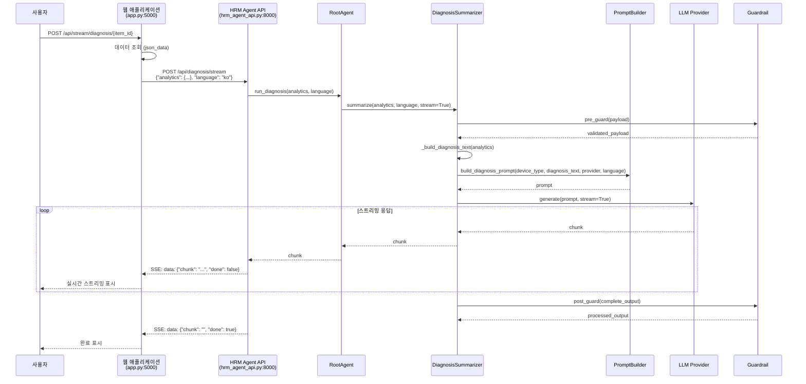
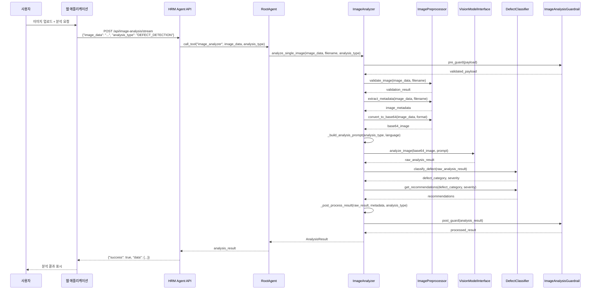
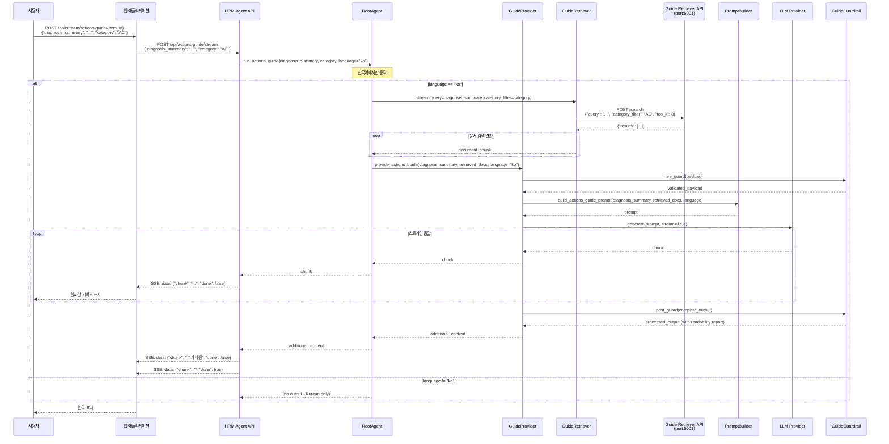
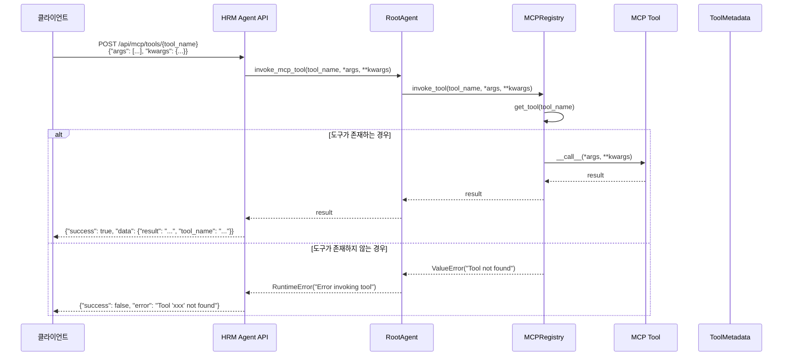
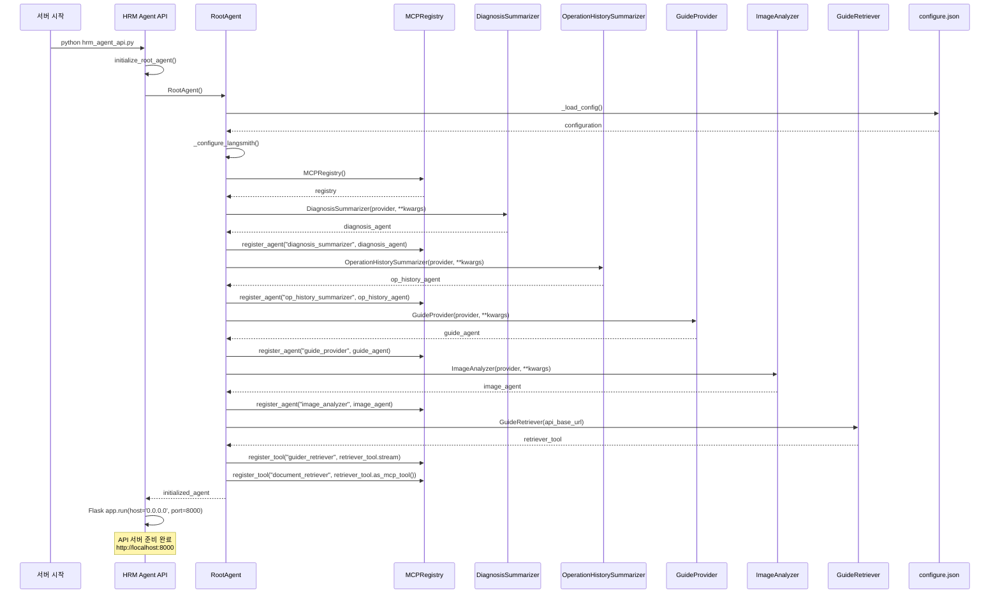

# HRM Agent 시스템 시퀀스 다이어그램

## 1. 진단 요약 생성 플로우

## 2. 이미지 분석 플로우

## 3. 고객 조치 가이드 생성 플로우

## 4. MCP 도구 호출 플로우

## 5. 시스템 초기화 플로우

## 주요 플로우 설명

### 1. 진단 요약 생성
- 웹 애플리케이션에서 특정 제품 ID의 진단 데이터를 API 서버로 전송
- API 서버는 RootAgent를 통해 DiagnosisSummarizer를 호출
- 스트리밍 방식으로 실시간 요약 결과를 사용자에게 전달

### 2. 이미지 분석
- 사용자가 업로드한 이미지를 ImageAnalyzer가 분석
- 이미지 전처리, 메타데이터 추출, 비전 모델 분석, 결함 분류 과정을 거침
- 구조화된 분석 결과를 반환

### 3. 고객 조치 가이드 생성
- 진단 요약을 바탕으로 관련 문서를 검색
- 검색된 문서와 진단 요약을 결합하여 맞춤형 조치 가이드 생성
- 한국어에서만 동작하는 특화 기능

### 4. MCP 도구 호출
- MCP 레지스트리를 통한 안전한 도구 호출
- 도구 존재 여부 확인 및 오류 처리

### 5. 시스템 초기화
- 설정 파일 로드, 에이전트 등록, 도구 등록 과정
- 모든 컴포넌트의 체계적인 초기화
